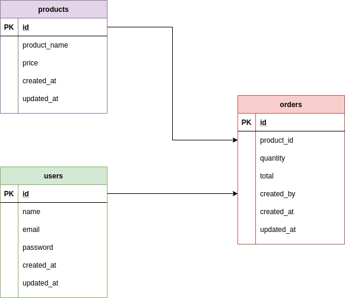
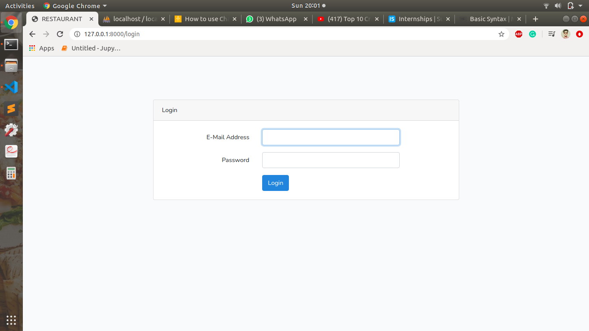
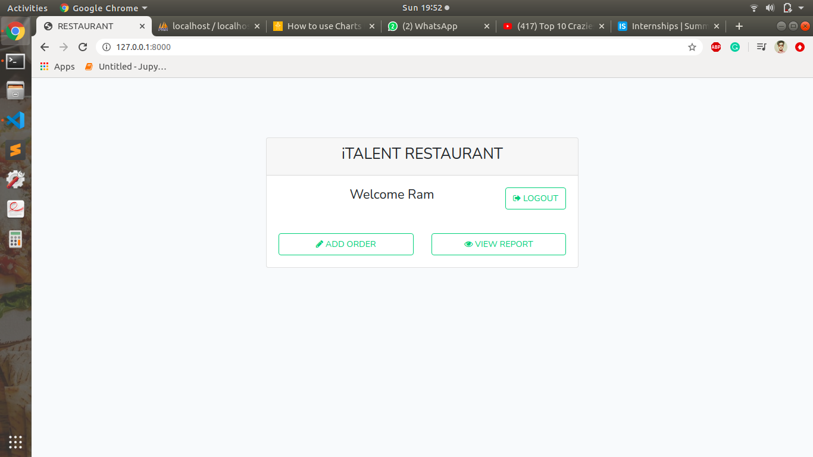
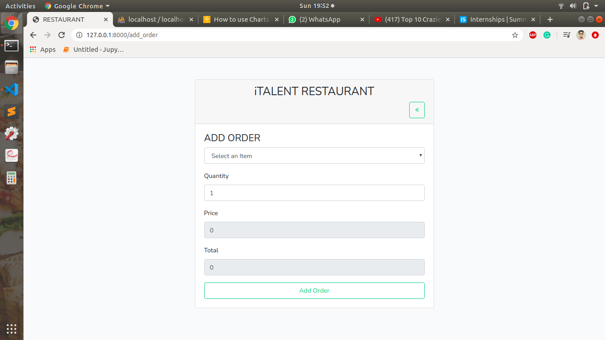
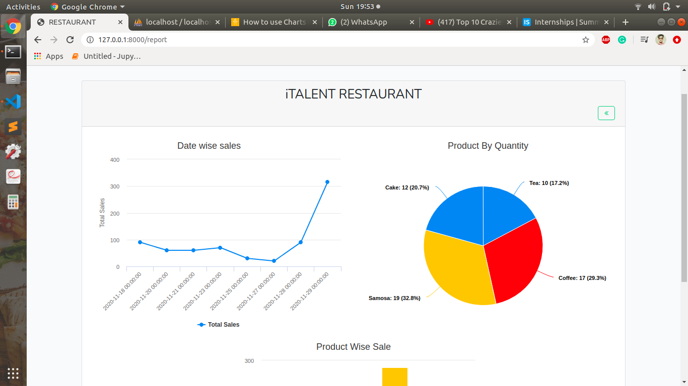

# Objective
It was a task for Internship. In this, My task was to create a web app for The Restaurant, where i had to give the features like login page, add order, view reports and logout etc.  

# Requirments
[Link](requirements.pdf)

# Technologies Used
* Frontend: HTML, CSS, Boostrap 4, jQuery, Charts
* Backend: PHP, Laravel
* Database: MySQL

# Installation
* pull this repository
* open this project in any text editor
* open .env file, and fill the database credentials. 
* run this command to install the project
```sh
npm install
php artisan migrate
```

# Database Design


# Snapshots
* login screen

* Home screen

* Add Order screen

* View Reports screen
